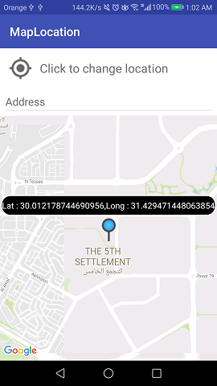

# MapLocation
Map Like Uber app

this project was about take the location of the pin when you move the map under it like uber app when you want to request and a pin appear to you to get your location

